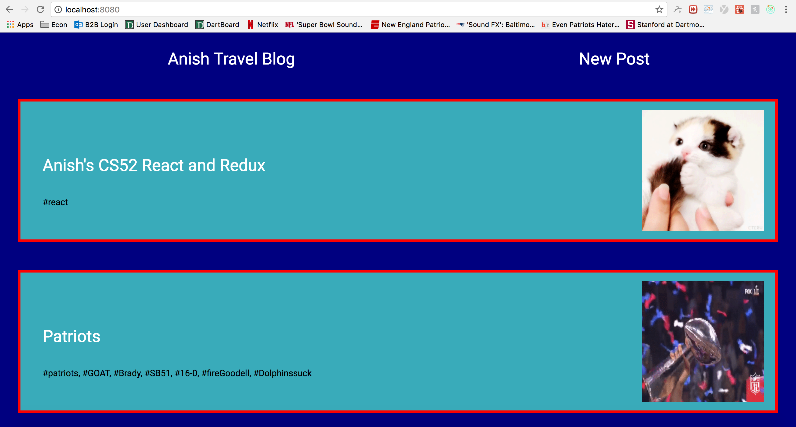
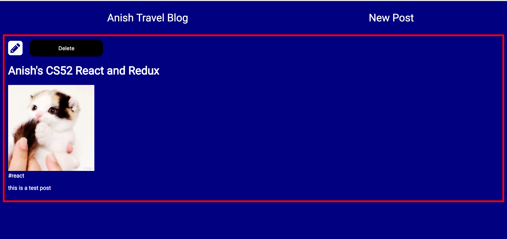
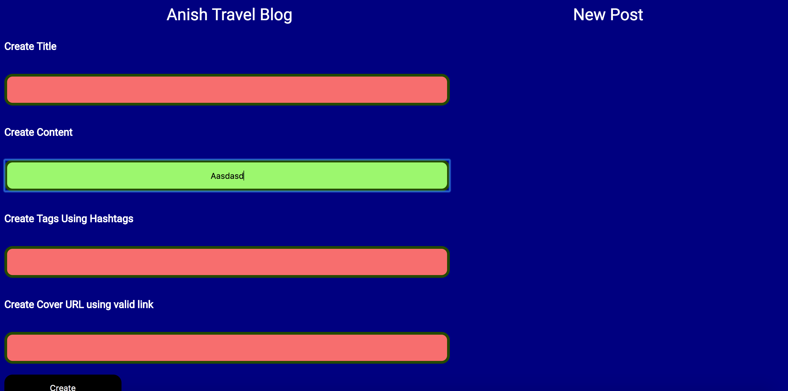

Anish Chadalavada  
Computer Science 52  
Lab Assignment 4 - Redux Blog Front End  
May 3, 2017  

EXTRA CREDIT -- for extra credit I implemented input validation for the creation of new blog posts, such that text had to be input for the title, tags, and content fields, and a valid URL had to be input for the cover URL field, otherwise the color of the input bar would remain red (valid info would cause it to change to green).

This lab utilized Redux to maintain state globally for the most part. We connected Redux with React in order to develop a blog application. We used the Axios API calls in order to update the server side based on updates, creations, and deletes on the front end. We used actions and reducers as well as a global state store in tandem with react components in order to complete a functioning blog component.

Citations (code citations contained inline):  
https://css-tricks.com/snippets/css/a-guide-to-flexbox/  
http://stackoverflow.com/questions/7291873/disable-color-change-of-anchor-tag-when-visited  
https://css-tricks.com/almanac/selectors/v/valid/
https://www.w3schools.com/tags/att_input_type.asp    
https://www.w3schools.com/css/css3_buttons.asp   
https://www.w3schools.com/css/css_form.asp   
I discussed this assignment with Alex and Dami.
Thanks to Tim for all his help during office hours, as well as the TAs Irene, Robin, and Jon for helping me a great deal to both develop and debug during TA hours (as usual!).

Main Page with all the posts (utilized fetchposts for this):  
     

Blog full show view (used react router to do posts/:postID and fetchpost for this):  
  

New post creator view (used createPost for this):  
  
That one has input feedback as shown based on the coloring of the input bars although the button doesn't mute or anything without the info. Up to user to follow the red/green input bar guidelines to make sure info is correct
